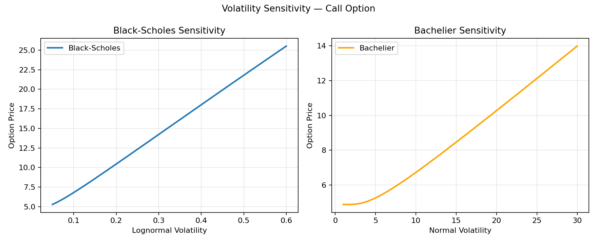
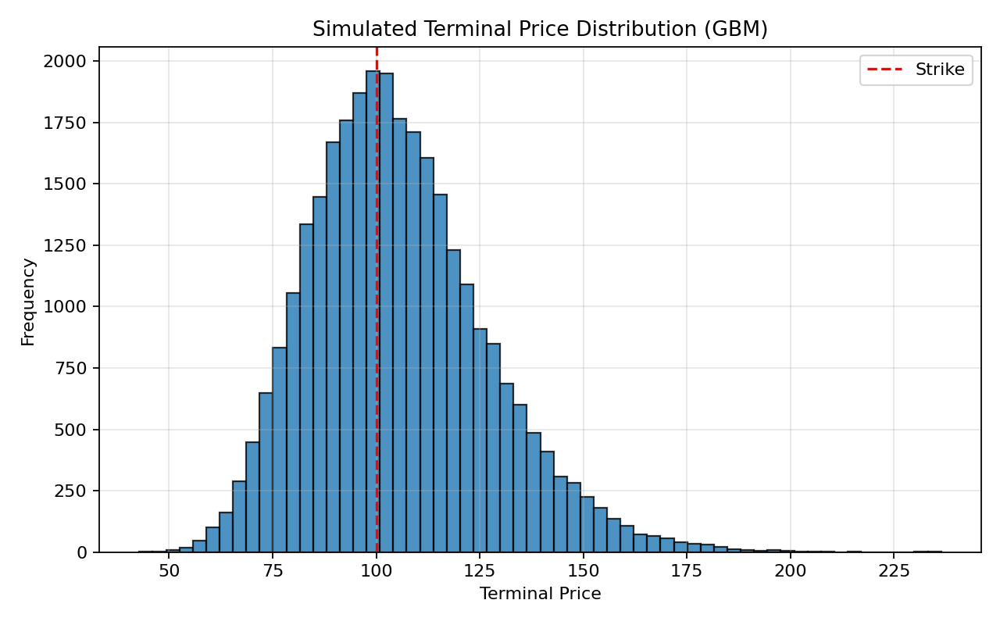

# Quant Options Toolkit


A compact Python project for pricing European options, computing simple Greeks, estimating implied volatility, and comparing closed-form models with Monte Carlo simulation.

## What it does

- Black-Scholes pricing for European calls and puts
- Bachelier pricing for European calls and puts
- Monte Carlo pricing under geometric Brownian motion
- Finite-difference Greeks
- Implied volatility by bisection
- Volatility sensitivity plots
- Terminal price distribution plots

## Repository layout

```text
quant-options-toolkit/
├── README.md
├── LICENSE
├── requirements.txt
├── requirements-dev.txt
├── src/
│   └── options_pricing_toolkit.py
├── examples/
│   └── demo.py
├── docs/
│   ├── volatility_sensitivity.png
│   └── terminal_distribution.png
├── test_options_pricing_toolkit.py
└── .gitignore
```

## Installation

```bash
python -m venv .venv
source .venv/bin/activate
pip install -r requirements.txt
```

On Windows PowerShell:

```powershell
python -m venv .venv
.venv\Scripts\Activate.ps1
pip install -r requirements.txt
```

To run tests as well:

```bash
pip install -r requirements-dev.txt
pytest
```

## Run the example

```bash
python examples/demo.py
```

The demo prints a summary to the console, saves figures into `docs/`, and opens the plots.

## Example output

```text
Black-Scholes call price: 10.4506
Bachelier call price: 4.8771
Monte Carlo call price: 10.4067 ± 0.0464
Greeks:
  delta: 0.6368
  vega: 37.5240
  rho: 53.2325
  theta: -6.4140
Implied volatility from BS price: 0.2000
```

## Example plots

### Volatility sensitivity



### Terminal price distribution



## Notes on model conventions

Black-Scholes and Bachelier do not use the same volatility convention.

- Black-Scholes uses lognormal volatility, expressed as a dimensionless annualized standard deviation
- Bachelier uses normal volatility, expressed in price units per square-root-year

Because of this, the same numerical volatility input does not correspond to the same level of uncertainty across the two models. The sensitivity figure therefore uses separate volatility ranges for the two models.

## Notes

- Black-Scholes assumes lognormal dynamics.
- Bachelier assumes normal dynamics.
- The Greeks here use finite differences rather than closed-form formulas.
- Implied volatility is recovered with a simple bisection routine.
- Monte Carlo simulation is done under geometric Brownian motion.

## Limitations

- European options only
- No dividends or carry adjustments
- No calibration framework
- Monte Carlo uses plain sampling, without variance reduction
- Greeks are numerical rather than analytic
- No historical market data or backtesting component

## Possible extensions

- Closed-form Black-Scholes Greeks
- Binomial tree pricing
- Barrier and Asian options
- Variance reduction for Monte Carlo
- Delta hedging PnL simulation
- Local volatility or stochastic volatility models
- A simple backtesting or signal-research module
