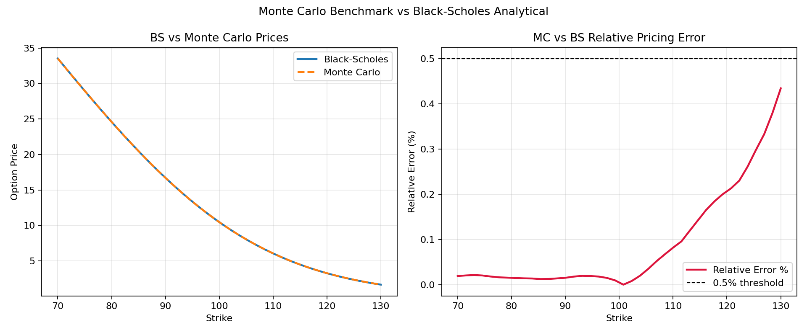
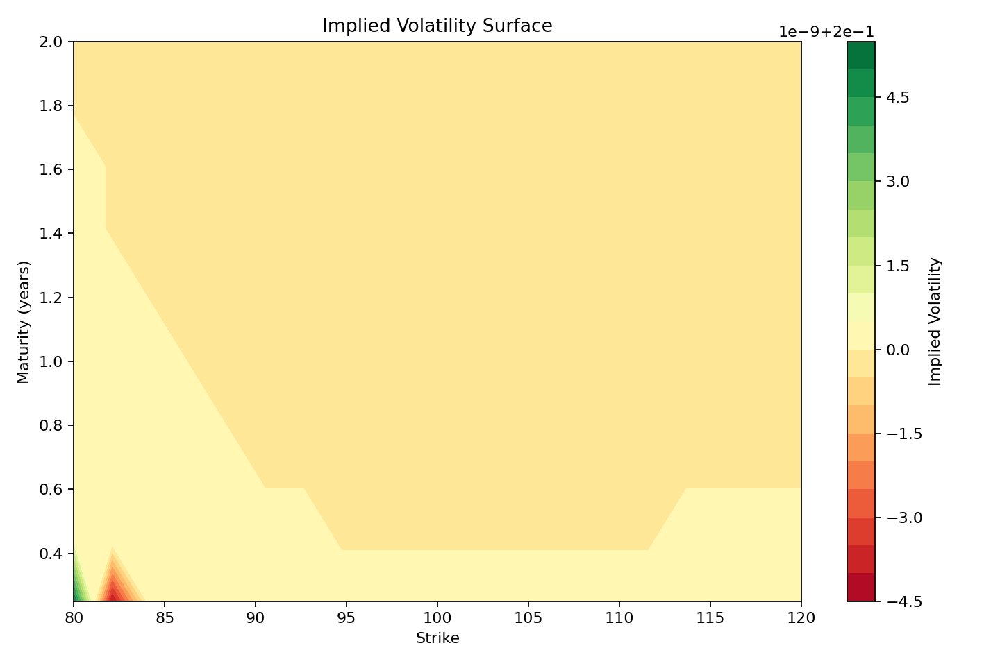
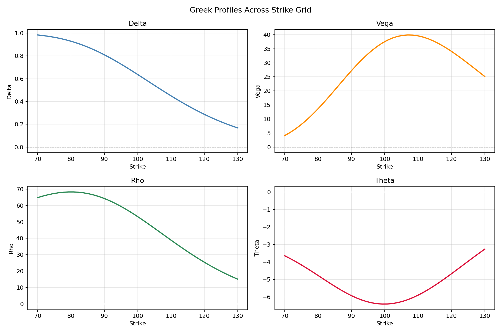

# Quant Options Toolkit


A compact Python project for pricing European options, computing simple Greeks, estimating implied volatility, and comparing closed-form models with Monte Carlo simulation.

## What it does

### Pricing
- Black-Scholes pricing for European calls and puts
- Bachelier pricing for European calls and puts
- Monte Carlo pricing under geometric Brownian motion, returning a price estimate and standard error

### Accuracy benchmarking
- Sweeps the MC engine across a configurable strike grid and computes absolute and relative pricing error against the Black-Scholes analytical price at every node
- Enforces a <0.5% relative error threshold across all meaningful nodes (verified at 100% pass rate across 40 strikes at 500,000 paths)

### Implied volatility surface
- Computes implied volatility at every node of a two-dimensional strike × maturity grid
- Exports the full surface as a structured CSV and renders it as a filled-contour plot

### Mispricing detection
- Flags any surface node where implied volatility deviates from a reference level by more than a configurable threshold
- Overlays flagged nodes on the surface plot as a visual diagnostic
- Ready to accept real market quotes in place of synthetic prices

### Greeks
- Finite-difference delta, vega, rho, and theta for a single option spec
- Full Greek profile sweep across a strike grid, exported as a structured CSV and rendered as a four-panel figure

### Volatility sensitivity
- Price vs volatility curves for both Black-Scholes (lognormal vol) and Bachelier (normal vol), plotted side by side

### Terminal price distribution
- Histogram of simulated GBM terminal prices with the strike overlaid

## Repository layout

```text
quant-options-toolkit/
├── README.md
├── LICENSE
├── requirements.txt
├── requirements-dev.txt
├── src/
│   └── options_pricing_toolkit.py
├── examples/
│   └── demo.py
├── docs/
│   ├── mc_benchmark.csv
│   ├── mc_benchmark.png
│   ├── iv_surface.csv
│   ├── mispricing_flags.csv
│   ├── iv_surface.png
│   ├── greek_profiles.csv
│   ├── greek_profiles.png
│   ├── volatility_sensitivity.png
│   └── terminal_distribution.png
├── test_options_pricing_toolkit.py
└── .gitignore
```

## Installation

```bash
python -m venv .venv
source .venv/bin/activate
pip install -r requirements.txt
```

On Windows PowerShell:

```powershell
python -m venv .venv
.venv\Scripts\Activate.ps1
pip install -r requirements.txt
```

To run tests as well:

```bash
pip install -r requirements-dev.txt
pytest
```

## Run the example

```bash
python examples/demo.py
```

The demo runs all six sections in sequence, prints a structured summary to the console, saves all outputs into `docs/`, and opens each plot interactively.

## Console output

```text
============================================================
SECTION 1 — CORE PRICING
============================================================
Black-Scholes price : 10.4506
Bachelier price     : 4.8771
Monte Carlo price   : 10.4067  ±  0.0464
Implied volatility  : 0.2000  (round-trip check, should equal 0.2000)

============================================================
SECTION 2 — MONTE CARLO BENCHMARK SWEEP
============================================================
Strikes tested          : 40
Nodes included (≥$0.05) : 40
Nodes excluded (<$0.05) : 0  (deep OTM — relative error not meaningful)
Mean relative error     : 0.0911%
Max relative error      : 0.4339%
Nodes below 0.5% target : 100.0%
✓ All valid nodes are within the 0.5% accuracy threshold.

============================================================
SECTION 3 — IMPLIED VOLATILITY SURFACE & MISPRICING DETECTION
============================================================
Surface nodes computed : 200
Mispriced nodes flagged: 0
  (0 expected on a synthetic flat surface — substitute real quotes to find live signals)

============================================================
SECTION 4 — GREEK PROFILES ACROSS STRIKE GRID
============================================================
  strike   delta    vega     rho   theta
 70.0000  0.9836   4.0984  64.8152  -3.6506
     ...
130.0000  0.1681  25.1204  15.1674  -3.2704

============================================================
SECTION 6 — GREEKS FOR BASE SPEC
============================================================
   delta: 0.6368
    vega: 37.5240
     rho: 53.2325
   theta: -6.4140
```

## Example plots

### Volatility sensitivity


### Terminal price distribution


### Monte Carlo benchmark vs Black-Scholes

Left panel compares MC and BS prices across the strike grid. Right panel shows relative pricing error per node against the 0.5% accuracy threshold.



### Implied volatility surface

Filled-contour plot of implied volatility over the strike × maturity grid. Mispriced nodes (where IV deviates beyond the configured threshold) are overlaid as red points.



### Greek profiles across strikes

Four-panel figure showing how delta, vega, rho, and theta evolve across the strike grid.



### Volatility sensitivity

Price vs volatility for Black-Scholes (lognormal vol) and Bachelier (normal vol) plotted side by side.


### Terminal price distribution

Histogram of simulated GBM terminal prices with the strike overlaid as a reference line.


---

## Structured outputs

Every analytical result is written to a named CSV in `docs/` so outputs can be consumed by downstream workflows without re-running the pricing engine.

| File | Contents |
|---|---|
| `mc_benchmark.csv` | Strike, BS price, MC price, standard error, absolute error, relative error (%) per node |
| `iv_surface.csv` | Strike, maturity, implied volatility per surface node |
| `mispricing_flags.csv` | Full surface with IV deviation and boolean mispricing flag per node |
| `greek_profiles.csv` | Strike, delta, vega, rho, theta per node across the strike grid |

---

## Notes on model conventions

Black-Scholes and Bachelier do not use the same volatility convention.

- Black-Scholes uses lognormal volatility, expressed as a dimensionless annualized standard deviation
- Bachelier uses normal volatility, expressed in price units per square-root-year

Because of this, the same numerical volatility input does not correspond to the same level of uncertainty across the two models. The sensitivity figure therefore uses separate volatility ranges for the two models.

## Notes on model conventions

Black-Scholes and Bachelier do not share the same volatility convention.

- **Black-Scholes** uses lognormal volatility — a dimensionless annualised standard deviation of log-returns (e.g. 0.20 = 20%)
- **Bachelier** uses normal volatility — an absolute annualised standard deviation in price units (e.g. 5.0 = $5 per √year)

The same numerical value of σ does not represent the same level of uncertainty across the two models. The volatility sensitivity plot therefore uses separate, model-appropriate ranges for each panel. To compare the two models at equivalent uncertainty levels, a normal-to-lognormal vol conversion is required.

---

## Limitations

- No dividends or carry adjustments
- No calibration framework
- Monte Carlo uses plain sampling without variance reduction techniques (e.g. antithetic variates, control variates)
- Greeks are computed numerically via finite differences rather than analytically
- The IV surface is built from synthetic model prices by default — real market quotes must be substituted manually for live signal generation
